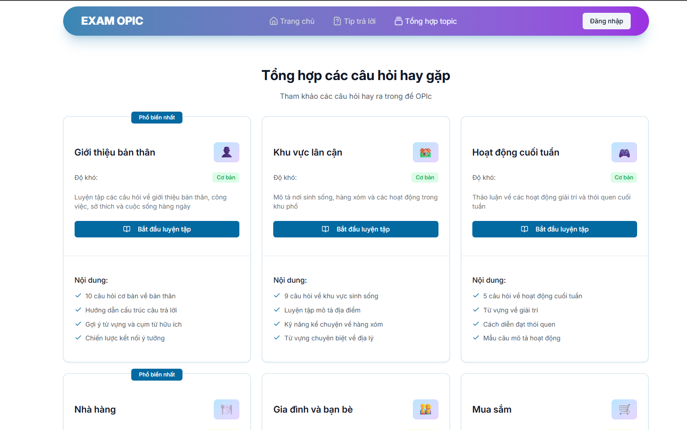
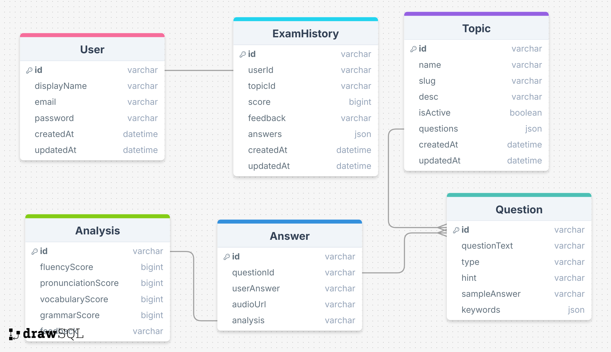

<!-- TODO: Thay thế [Tên Dự Án] và các thông tin trong ngoặc vuông -->

  

<h1 align="center">OPIc Exam</h1>

  Một dự án giúp bạn luyện tập và thi thử OPIc một cách hiệu quả. Có rất nhiều tính năng hữu ích để cải thiện kỹ năng nói của bạn.
   
  <a href="https://project-exam-opic.vercel.app/"><strong>XEM TRANG WEB »</strong></a>
   
   

<!-- MỤC LỤC -->

## Mục lục

 

    <a href="#về-dự-án"><kbd style="padding: 5px 20px"> <b> VỀ DỰ ÁN </b> </kbd></a>&ensp;&ensp;
    <a href="#tính-năng"><kbd style="padding: 5px 20px"> <b> TÍNH NĂNG </b> </kbd></a>&ensp;&ensp;
    <a href="#database"><kbd style="padding: 5px 20px"> <b> DATABASE </b> </kbd></a>&ensp;&ensp;
    <a href="#LICENSE"><kbd style="padding: 5px 20px"> <b> GIẤY PHÉP </b> </kbd></a>&ensp;&ensp;

 

<!-- VỀ DỰ ÁN -->

## Về dự án

Dự án này được tạo ra nhằm giúp người học luyện tập và thi thử OPIc một cách hiệu quả. Với giao diện thân thiện và nhiều tính năng hữu ích, bạn có thể cải thiện kỹ năng nói của mình một cách nhanh chóng.

<!-- TÍNH NĂNG -->

## Tính năng

-   Xem đa dạng các chủ đề OPIc
-   Thi thử với các câu hỏi ngẫu nhiên
-   Luyện tập phản xạ trả lời câu hỏi
-   Ghi âm và phát lại câu trả lời của bạn
-   Nhận phản hồi và đánh giá từ hệ thống
-   Lưu lịch sử thi và tiến trình học tập

## Database

Dữ liệu câu hỏi OPIc được lưu trữ trong một cơ sở dữ liệu MongoDB. Dưới đây là cấu trúc của các bộ sưu tập chính:

 

## LICENSE

Dự án này được cấp phép theo giấy phép MIT. Xem tệp [LICENSE](./LICENSE) để biết thêm chi tiết.
